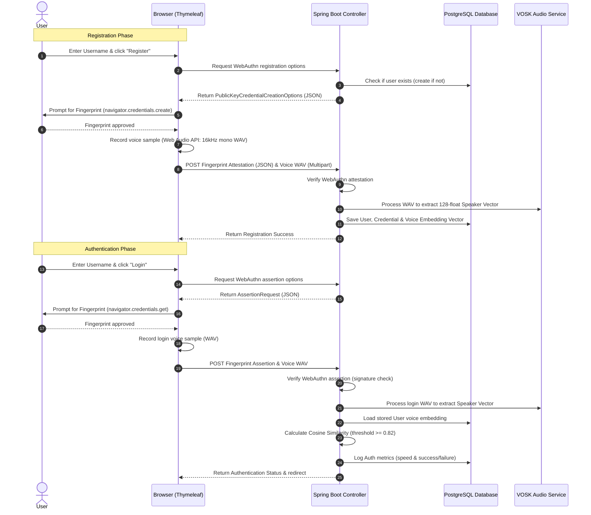

# Step-by-Step Walkthrough: Multi-Modal Authentication System (WebAuthn + VOSK Voice Recognition)

This walkthrough provides a comprehensive guide to building a multi-modal authentication system using **Spring Boot**, **Thymeleaf**, **PostgreSQL**, **WebAuthn (Yubico)**, and **VOSK Speaker Recognition**.

---

## 1. System Architecture Flow

The multi-modal authentication flow relies on two factors: **Fingerprint (WebAuthn)** and **Voice (VOSK)**.



---

## 2. Database Schema & JPA Entities (PostgreSQL)

To store credentials, voice signatures, and audit logs for the metrics dashboard, we define the following schema.

### Database Tables (DDL)
```sql
-- PostgreSQL DDL for multi-modal auth schema
CREATE TABLE users (
    id UUID PRIMARY KEY,
    username VARCHAR(100) UNIQUE NOT NULL
);

CREATE TABLE webauthn_credentials (
    id BIGSERIAL PRIMARY KEY,
    credential_id BYTEA UNIQUE NOT NULL,
    public_key BYTEA NOT NULL,
    signature_count BIGINT NOT NULL,
    user_id UUID REFERENCES users(id) ON DELETE CASCADE
);

CREATE TABLE voice_samples (
    id BIGSERIAL PRIMARY KEY,
    filepath VARCHAR(512) NOT NULL,
    type VARCHAR(50) NOT NULL,
    speaker_vector TEXT NOT NULL, -- Comma-separated floats representing 128-d x-vector
    user_id UUID REFERENCES users(id) ON DELETE CASCADE
);

CREATE TABLE auth_logs (
    id BIGSERIAL PRIMARY KEY,
    username VARCHAR(100) NOT NULL,
    success BOOLEAN NOT NULL,
    duration_ms BIGINT NOT NULL,
    timestamp TIMESTAMP WITHOUT TIME ZONE NOT NULL,
    failure_reason VARCHAR(255)
);
```

### JPA Entities

#### User Entity ([User.java](file:///c:/Users/seanj/Desktop/PortFolio/mmas/src/main/java/com/mmas/model/User.java))
We configure the user model to map to our table.
```java
package com.mmas.model;

import java.util.List;
import java.util.UUID;
import jakarta.persistence.*;
import lombok.Data;

@Entity
@Table(name = "users")
@Data
public class User {
    @Id
    @GeneratedValue(strategy = GenerationType.UUID)
    private UUID id;
    
    @Column(unique = true, nullable = false)
    private String username;

    @OneToMany(mappedBy = "user", cascade = CascadeType.ALL, fetch = FetchType.LAZY)
    private List<WebAuthnCredential> credentials;

    @OneToMany(mappedBy = "user", cascade = CascadeType.ALL, fetch = FetchType.LAZY)
    private List<VoiceSample> voiceSamples;
}
```

#### WebAuthn Credential Entity ([WebAuthnCredential.java](file:///c:/Users/seanj/Desktop/PortFolio/mmas/src/main/java/com/mmas/model/WebAuthnCredential.java))
Holds the WebAuthn public keys, credential IDs, and signature counter to prevent replay attacks.
```java
package com.mmas.model;

import jakarta.persistence.*;
import lombok.Data;

@Entity
@Table(name = "webauthn_credentials")
@Data
public class WebAuthnCredential {
    @Id
    @GeneratedValue(strategy = GenerationType.IDENTITY)
    private Long id;

    @Column(name = "credential_id", unique = true, nullable = false)
    private byte[] credentialId;

    @Column(name = "public_key", nullable = false)
    private byte[] publicKey;

    @Column(name = "signature_count", nullable = false)
    private long signatureCount;

    @ManyToOne(fetch = FetchType.LAZY)
    @JoinColumn(name = "user_id", nullable = false)
    private User user;
}
```

#### Voice Sample Entity ([VoiceSample.java](file:///c:/Users/seanj/Desktop/PortFolio/mmas/src/main/java/com/mmas/model/VoiceSample.java))
Stores the file path of the voice `.wav` on the server and the extracted 128-float speaker vector.
```java
package com.mmas.model;

import jakarta.persistence.*;
import lombok.Data;
import com.mmas.util.FloatArrayConverter;

@Entity
@Table(name = "voice_samples")
@Data
public class VoiceSample {
    @Id
    @GeneratedValue(strategy = GenerationType.IDENTITY)
    private Long id;

    @Column(nullable = false)
    private String filepath;

    @Column(nullable = false)
    private String type; // e.g. "REGISTRATION" or "AUTHENTICATION"

    @Column(name = "speaker_vector", columnDefinition = "TEXT", nullable = false)
    @Convert(converter = FloatArrayConverter.class)
    private float[] speakerVector;

    @ManyToOne(fetch = FetchType.LAZY)
    @JoinColumn(name = "user_id", nullable = false)
    private User user;
}
```

#### Database Helper Converter ([FloatArrayConverter.java](file:///c:/Users/seanj/Desktop/PortFolio/mmas/src/main/java/com/mmas/util/FloatArrayConverter.class))
Converts Java's `float[]` array to a simple comma-separated string for easy database storage.
```java
package com.mmas.util;

import jakarta.persistence.AttributeConverter;
import jakarta.persistence.Converter;

@Converter
public class FloatArrayConverter implements AttributeConverter<float[], String> {
    @Override
    public String convertToDatabaseColumn(float[] attribute) {
        if (attribute == null || attribute.length == 0) return "";
        StringBuilder sb = new StringBuilder();
        for (float val : attribute) {
            sb.append(val).append(",");
        }
        return sb.substring(0, sb.length() - 1);
    }

    @Override
    public float[] convertToEntityAttribute(String dbData) {
        if (dbData == null || dbData.trim().isEmpty()) return new float[0];
        String[] tokens = dbData.split(",");
        float[] floats = new float[tokens.length];
        for (int i = 0; i < tokens.length; i++) {
            floats[i] = Float.parseFloat(tokens[i].trim());
        }
        return floats;
    }
}
```

#### Authentication Log Entity ([AuthLog.java](file:///c:/Users/seanj/Desktop/PortFolio/mmas/src/main/java/com/mmas/model/AuthLog.java))
Maintains history for speed and accuracy analytics.
```java
package com.mmas.model;

import jakarta.persistence.*;
import lombok.Data;
import java.time.LocalDateTime;

@Entity
@Table(name = "auth_logs")
@Data
public class AuthLog {
    @Id
    @GeneratedValue(strategy = GenerationType.IDENTITY)
    private Long id;

    @Column(nullable = false)
    private String username;

    @Column(nullable = false)
    private boolean success;

    @Column(name = "duration_ms", nullable = false)
    private long durationMs;

    @Column(nullable = false)
    private LocalDateTime timestamp;

    @Column(name = "failure_reason")
    private String failureReason;
}
```

---

## 3. WebAuthn Integration (Yubico Server Core)

WebAuthn uses a challenge-response protocol. To set up WebAuthn on the server, we implement Yubico's `CredentialRepository` and create a `RelyingParty` bean.

### WebAuthn Repositories

#### WebAuthn Credential Repository ([WebAuthnCredentialRepository.java](file:///c:/Users/seanj/Desktop/PortFolio/mmas/src/main/java/com/mmas/repository/WebAuthnCredentialRepository.java))
```java
package com.mmas.repository;

import org.springframework.data.jpa.repository.JpaRepository;
import org.springframework.stereotype.Repository;
import com.mmas.model.WebAuthnCredential;
import com.mmas.model.User;
import java.util.List;
import java.util.Optional;

@Repository
public interface WebAuthnCredentialRepository extends JpaRepository<WebAuthnCredential, Long> {
    List<WebAuthnCredential> findByUser(User user);
    Optional<WebAuthnCredential> findByCredentialId(byte[] credentialId);
}
```

#### Yubico CredentialRepository Implementation ([JpaCredentialRepository.java](file:///c:/Users/seanj/Desktop/PortFolio/mmas/src/main/java/com/mmas/repository/JpaCredentialRepository.java))
```java
package com.mmas.repository;

import com.yubico.webauthn.CredentialRepository;
import com.yubico.webauthn.RegisteredCredential;
import com.yubico.webauthn.data.ByteArray;
import com.yubico.webauthn.data.PublicKeyCredentialDescriptor;
import com.yubico.webauthn.data.PublicKeyCredentialType;
import com.mmas.model.User;
import com.mmas.model.WebAuthnCredential;
import org.springframework.beans.factory.annotation.Autowired;
import org.springframework.stereotype.Service;

import java.util.*;
import java.util.stream.Collectors;

@Service
public class JpaCredentialRepository implements CredentialRepository {

    @Autowired
    private UserRepository userRepository;

    @Autowired
    private WebAuthnCredentialRepository credentialRepository;

    @Override
    public Set<PublicKeyCredentialDescriptor> getCredentialIdsForUsername(String username) {
        return userRepository.findByUsername(username)
            .map(user -> credentialRepository.findByUser(user).stream()
                .map(cred -> PublicKeyCredentialDescriptor.builder()
                    .type(PublicKeyCredentialType.PUBLIC_KEY)
                    .id(new ByteArray(cred.getCredentialId()))
                    .build())
                .collect(Collectors.toSet()))
            .orElse(Collections.emptySet());
    }

    @Override
    public Optional<ByteArray> getUserHandleForUsername(String username) {
        return userRepository.findByUsername(username)
            .map(user -> new ByteArray(user.getId().toString().getBytes()));
    }

    @Override
    public Optional<String> getUsernameForUserHandle(ByteArray userHandle) {
        try {
            UUID userId = UUID.fromString(new String(userHandle.getBytes()));
            return userRepository.findById(userId).map(User::getUsername);
        } catch (IllegalArgumentException e) {
            return Optional.empty();
        }
    }

    @Override
    public Optional<RegisteredCredential> lookup(ByteArray credentialId, ByteArray userHandle) {
        return credentialRepository.findByCredentialId(credentialId.getBytes())
            .map(cred -> RegisteredCredential.builder()
                .credentialId(credentialId)
                .userHandle(userHandle)
                .publicKey(new ByteArray(cred.getPublicKey()))
                .signatureCount(cred.getSignatureCount())
                .build());
    }

    @Override
    public Set<RegisteredCredential> lookupAll(ByteArray credentialId) {
        return credentialRepository.findByCredentialId(credentialId.getBytes()).stream()
            .map(cred -> RegisteredCredential.builder()
                .credentialId(credentialId)
                .userHandle(new ByteArray(cred.getUser().getId().toString().getBytes()))
                .publicKey(new ByteArray(cred.getPublicKey()))
                .signatureCount(cred.getSignatureCount())
                .build())
            .collect(Collectors.toSet());
    }
}
```

### Relying Party Bean Configuration ([WebAuthnConfig.java](file:///c:/Users/seanj/Desktop/PortFolio/mmas/src/main/java/com/mmas/config/WebAuthnConfig.java))
```java
package com.mmas.config;

import com.yubico.webauthn.CredentialRepository;
import com.yubico.webauthn.RelyingParty;
import com.yubico.webauthn.data.RelyingPartyIdentity;
import org.springframework.beans.factory.annotation.Value;
import org.springframework.context.annotation.Bean;
import org.springframework.context.annotation.Configuration;

import java.util.Collections;

@Configuration
public class WebAuthnConfig {

    @Value("${webauthn.rp-id}")
    private String rpId;

    @Value("${webauthn.rp-name}")
    private String rpName;

    @Value("${webauthn.allowed-origins}")
    private String allowedOrigin;

    @Bean
    public RelyingParty relyingParty(CredentialRepository credentialRepository) {
        RelyingPartyIdentity identity = RelyingPartyIdentity.builder()
            .id(rpId)
            .name(rpName)
            .build();

        return RelyingParty.builder()
            .identity(identity)
            .credentialRepository(credentialRepository)
            .origins(Collections.singleton(allowedOrigin))
            .build();
    }
}
```

---

## 4. VOSK Speaker Recognition Integration

We load the VOSK speech model and speaker identification model as singletons, write matching calculations, and handle audio uploads.

### VOSK Models Service ([VoskSpeakerService.java](file:///c:/Users/seanj/Desktop/PortFolio/mmas/src/main/java/com/mmas/service/VoskSpeakerService.java))

> [!NOTE]
> Ensure paths `vosk.model.path` and `vosk.spk.model.path` in `application.properties` map correctly to directory paths.

```java
package com.mmas.service;

import com.fasterxml.jackson.databind.JsonNode;
import com.fasterxml.jackson.databind.ObjectMapper;
import org.springframework.beans.factory.annotation.Value;
import org.springframework.stereotype.Service;
import org.vosk.Model;
import org.vosk.SpkModel;
import org.vosk.Recognizer;

import jakarta.annotation.PostConstruct;
import jakarta.annotation.PreDestroy;
import javax.sound.sampled.AudioInputStream;
import javax.sound.sampled.AudioSystem;
import java.io.BufferedInputStream;
import java.io.File;
import java.io.FileInputStream;

@Service
public class VoskSpeakerService {

    @Value("${vosk.model.path}")
    private String modelPath;

    @Value("${vosk.spk.model.path}")
    private String spkModelPath;

    private Model model;
    private SpkModel spkModel;
    private final ObjectMapper objectMapper = new ObjectMapper();

    @PostConstruct
    public void init() throws Exception {
        // Resolve absolute path if configured as classpath prefix or directory
        String cleanedModelPath = cleanPath(modelPath);
        String cleanedSpkPath = cleanPath(spkModelPath);

        this.model = new Model(cleanedModelPath);
        this.spkModel = new SpkModel(cleanedSpkPath);
    }

    private String cleanPath(String path) {
        if (path.startsWith("classpath:")) {
            return path.substring("classpath:".length());
        }
        return path;
    }

    @PreDestroy
    public void cleanup() {
        if (model != null) model.close();
        if (spkModel != null) spkModel.close();
    }

    /**
     * Extracts 128-float speaker vector (embedding/x-vector) from a 16kHz mono WAV file.
     */
    public float[] extractSpeakerVector(File wavFile) throws Exception {
        try (AudioInputStream ais = AudioSystem.getAudioInputStream(new BufferedInputStream(new FileInputStream(wavFile)))) {
            // Re-assert sample rate
            float sampleRate = ais.getFormat().getSampleRate();
            
            try (Recognizer recognizer = new Recognizer(model, sampleRate, spkModel)) {
                byte[] buffer = new byte[4096];
                int bytesRead;
                while ((bytesRead = ais.read(buffer)) != -1) {
                    recognizer.acceptWaveform(buffer, bytesRead);
                }

                String resultJson = recognizer.getFinalResult();
                return parseSpeakerVector(resultJson);
            }
        }
    }

    private float[] parseSpeakerVector(String jsonResult) throws Exception {
        JsonNode node = objectMapper.readTree(jsonResult);
        if (node.has("spk")) {
            JsonNode spkNode = node.get("spk");
            float[] vector = new float[spkNode.size()];
            for (int i = 0; i < spkNode.size(); i++) {
                vector[i] = (float) spkNode.get(i).asDouble();
            }
            return vector;
        }
        throw new IllegalArgumentException("VOSK: No speaker signature identified in audio sample. Please speak clearly.");
    }

    /**
     * Computes Cosine Similarity between two voice embedding vectors.
     * Formula: (A . B) / (||A|| * ||B||)
     */
    public double calculateSimilarity(float[] vectorA, float[] vectorB) {
        if (vectorA == null || vectorB == null || vectorA.length != vectorB.length || vectorA.length == 0) {
            return 0.0;
        }
        double dotProduct = 0.0;
        double normA = 0.0;
        double normB = 0.0;
        for (int i = 0; i < vectorA.length; i++) {
            dotProduct += vectorA[i] * vectorB[i];
            normA += vectorA[i] * vectorA[i];
            normB += vectorB[i] * vectorB[i];
        }
        if (normA == 0.0 || normB == 0.0) {
            return 0.0;
        }
        return dotProduct / (Math.sqrt(normA) * Math.sqrt(normB));
    }
}
```

---

## 5. Multi-Modal Controller (WebAuthn + VOSK)

This Controller handles generating challenges, enrolling credentials/voice vectors during registration, and verifying both factors on authentication attempts.

#### Auth Controller ([AuthenticationApiController.java](file:///c:/Users/seanj/Desktop/PortFolio/mmas/src/main/java/com/mmas/controller/AuthenticationApiController.java))
```java
package com.mmas.controller;

import com.yubico.webauthn.*;
import com.yubico.webauthn.data.*;
import com.mmas.model.*;
import com.mmas.repository.*;
import com.mmas.service.VoskSpeakerService;
import org.springframework.beans.factory.annotation.Autowired;
import org.springframework.beans.factory.annotation.Value;
import org.springframework.http.ResponseEntity;
import org.springframework.web.bind.annotation.*;
import org.springframework.web.multipart.MultipartFile;

import jakarta.servlet.http.HttpSession;
import java.io.File;
import java.time.LocalDateTime;
import java.util.*;

@RestController
@RequestMapping("/api/auth")
public class AuthenticationApiController {

    @Autowired
    private RelyingParty relyingParty;

    @Autowired
    private UserRepository userRepository;

    @Autowired
    private WebAuthnCredentialRepository credentialRepository;

    @Autowired
    private VoiceSampleRepo voiceSampleRepository;

    @Autowired
    private AuthLogRepository authLogRepository;

    @Autowired
    private VoskSpeakerService voskSpeakerService;

    @Value("${voice.storage.path}")
    private String voiceUploadDir;

    private static final String REG_OPTIONS_KEY = "reg-options-";
    private static final String AUTH_REQUEST_KEY = "auth-request-";

    /* ========================================================================= */
    /* REGISTRATION FLOW                                                         */
    /* ========================================================================= */

    @PostMapping("/register/options")
    public ResponseEntity<?> getRegisterOptions(@RequestParam String username, HttpSession session) {
        try {
            Optional<User> existingUser = userRepository.findByUsername(username);
            User user = existingUser.orElseGet(() -> {
                User u = new User();
                u.setUsername(username);
                return userRepository.save(u);
            });

            PublicKeyCredentialCreationOptions options = relyingParty.startRegistration(
                StartRegistrationOptions.builder()
                    .user(UserIdentity.builder()
                        .name(username)
                        .displayName(username)
                        .id(new ByteArray(user.getId().toString().getBytes()))
                        .build())
                    .build()
            );

            session.setAttribute(REG_OPTIONS_KEY + username, options);
            return ResponseEntity.ok(options.toJson());
        } catch (Exception e) {
            return ResponseEntity.badRequest().body(Map.of("error", e.getMessage()));
        }
    }

    @PostMapping("/register/finish")
    public ResponseEntity<?> finishRegistration(
            @RequestParam String username,
            @RequestParam String credentialJson,
            @RequestParam("voice") MultipartFile voiceFile,
            HttpSession session) {
        try {
            // 1. Fetch Options
            PublicKeyCredentialCreationOptions options = 
                (PublicKeyCredentialCreationOptions) session.getAttribute(REG_OPTIONS_KEY + username);
            if (options == null) {
                return ResponseEntity.badRequest().body(Map.of("error", "Registration session expired."));
            }
            session.removeAttribute(REG_OPTIONS_KEY + username);

            User user = userRepository.findByUsername(username)
                .orElseThrow(() -> new RuntimeException("User context not found."));

            // 2. Verify WebAuthn attestation
            PublicKeyCredential<AuthenticatorAttestationResponse, ClientRegistrationExtensionOutputs> pkc = 
                PublicKeyCredential.parseRegistrationResponseJson(credentialJson);

            RegistrationResult result = relyingParty.finishRegistration(
                FinishRegistrationOptions.builder()
                    .request(options)
                    .response(pkc)
                    .build()
            );

            // 3. Process voice WAV sample
            File tempFile = File.createTempFile("reg_voice_", ".wav");
            voiceFile.transferTo(tempFile);
            
            float[] speakerVector = voskSpeakerService.extractSpeakerVector(tempFile);

            // Store permanent audio WAV
            File uploadFolder = new File(cleanUploadDir(voiceUploadDir));
            if (!uploadFolder.exists()) uploadFolder.mkdirs();
            File destFile = new File(uploadFolder, user.getId() + "_reg.wav");
            tempFile.renameTo(destFile);

            // 4. Save WebAuthn credential & Voice metadata to Database
            WebAuthnCredential credential = new WebAuthnCredential();
            credential.setCredentialId(result.getKeyId().getId().getBytes());
            credential.setPublicKey(result.getPublicKeyCOSE().getBytes());
            credential.setSignatureCount(result.getSignatureCount());
            credential.setUser(user);
            credentialRepository.save(credential);

            VoiceSample sample = new VoiceSample();
            sample.setFilepath(destFile.getAbsolutePath());
            sample.setType("REGISTRATION");
            sample.setSpeakerVector(speakerVector);
            sample.setUser(user);
            voiceSampleRepository.save(sample);

            return ResponseEntity.ok(Map.of("success", true));
        } catch (Exception e) {
            return ResponseEntity.badRequest().body(Map.of("error", e.getMessage()));
        }
    }

    /* ========================================================================= */
    /* LOGIN FLOW (MULTI-MODAL VERIFICATION)                                     */
    /* ========================================================================= */

    @PostMapping("/login/options")
    public ResponseEntity<?> getLoginOptions(@RequestParam String username, HttpSession session) {
        try {
            AssertionRequest assertionRequest = relyingParty.startAssertion(
                StartAssertionOptions.builder()
                    .username(Optional.of(username))
                    .build()
            );
            session.setAttribute(AUTH_REQUEST_KEY + username, assertionRequest);
            return ResponseEntity.ok(assertionRequest.toJson());
        } catch (Exception e) {
            return ResponseEntity.badRequest().body(Map.of("error", "No credentials registered for username"));
        }
    }

    @PostMapping("/login/finish")
    public ResponseEntity<?> finishLogin(
            @RequestParam String username,
            @RequestParam String credentialJson,
            @RequestParam("voice") MultipartFile voiceFile,
            HttpSession session) {
        
        long startTime = System.currentTimeMillis();
        User user = userRepository.findByUsername(username).orElse(null);
        
        try {
            // 1. Verify user context
            if (user == null) {
                throw new IllegalArgumentException("Username not registered.");
            }

            // 2. Fetch Options
            AssertionRequest assertionRequest = 
                (AssertionRequest) session.getAttribute(AUTH_REQUEST_KEY + username);
            if (assertionRequest == null) {
                throw new IllegalStateException("Authentication session expired.");
            }
            session.removeAttribute(AUTH_REQUEST_KEY + username);

            // 3. FACTOR 1: WebAuthn verification
            PublicKeyCredential<AuthenticatorAssertionResponse, ClientAssertionExtensionOutputs> pkc = 
                PublicKeyCredential.parseAssertionResponseJson(credentialJson);

            AssertionResult webauthnResult = relyingParty.finishAssertion(
                FinishAssertionOptions.builder()
                    .request(assertionRequest)
                    .response(pkc)
                    .build()
            );

            if (!webauthnResult.isSuccess()) {
                throw new SecurityException("WebAuthn verification failed.");
            }

            // Update signature count in DB
            WebAuthnCredential credential = credentialRepository.findByCredentialId(webauthnResult.getCredentialId().getBytes())
                .orElseThrow(() -> new SecurityException("Matched credential record missing."));
            credential.setSignatureCount(webauthnResult.getSignatureCount());
            credentialRepository.save(credential);

            // 4. FACTOR 2: Voice Verification (VOSK Speaker Recognition)
            File tempFile = File.createTempFile("auth_voice_", ".wav");
            voiceFile.transferTo(tempFile);

            float[] currentVector = voskSpeakerService.extractSpeakerVector(tempFile);
            tempFile.delete(); // Cleanup temp audio

            // Retrieve registration reference vector
            VoiceSample referenceSample = user.getVoiceSamples().stream()
                .filter(s -> "REGISTRATION".equals(s.getType()))
                .findFirst()
                .orElseThrow(() -> new SecurityException("Vocal reference print not found."));

            double similarity = voskSpeakerService.calculateSimilarity(currentVector, referenceSample.getSpeakerVector());
            double threshold = 0.82; // Cosine similarity threshold for verification

            if (similarity < threshold) {
                throw new SecurityException(String.format("Voice verification failed. Match score: %.2f (required >= %.2f)", similarity, threshold));
            }

            // Log successful attempt
            logAuth(username, true, System.currentTimeMillis() - startTime, null);
            
            // Log user in custom session context
            session.setAttribute("user", username);
            return ResponseEntity.ok(Map.of("success", true, "similarity", similarity));

        } catch (Exception e) {
            logAuth(username, false, System.currentTimeMillis() - startTime, e.getMessage());
            return ResponseEntity.status(401).body(Map.of("error", e.getMessage()));
        }
    }

    private void logAuth(String username, boolean success, long duration, String reason) {
        AuthLog log = new AuthLog();
        log.setUsername(username);
        log.setSuccess(success);
        log.setDurationMs(duration);
        log.setTimestamp(LocalDateTime.now());
        log.setFailureReason(reason);
        authLogRepository.save(log);
    }

    private String cleanUploadDir(String path) {
        if (path.startsWith("classpath:")) {
            return "voice_uploads";
        }
        return path;
    }
}
```

#### Metrics Repository Interface ([AuthLogRepository.java](file:///c:/Users/seanj/Desktop/PortFolio/mmas/src/main/java/com/mmas/repository/AuthLogRepository.java))
```java
package com.mmas.repository;

import com.mmas.model.AuthLog;
import org.springframework.data.jpa.repository.JpaRepository;
import org.springframework.data.jpa.repository.Query;
import org.springframework.stereotype.Repository;

import java.util.List;

@Repository
public interface AuthLogRepository extends JpaRepository<AuthLog, Long> {
    
    @Query("SELECT AVG(a.durationMs) FROM AuthLog a WHERE a.success = true")
    Double getAverageSuccessDuration();

    @Query("SELECT COUNT(a) FROM AuthLog a WHERE a.success = true")
    long countSuccessfulAttempts();

    @Query("SELECT COUNT(a) FROM AuthLog a")
    long countTotalAttempts();

    List<AuthLog> findFirst10ByOrderByTimestampDesc();
}
```

---

## 6. Sleek & Interactive Frontend (Thymeleaf templates)

Here we design premium Thymeleaf templates styled with a sleek, dark-mode, glassmorphism design.

### Shared CSS Stylesheet ([index.css](file:///c:/Users/seanj/Desktop/PortFolio/mmas/src/main/resources/static/css/index.css))
```css
/* Sleek Dark-Mode Design System & Tokens */
:root {
    --bg-dark: #090d16;
    --card-bg: rgba(17, 24, 39, 0.7);
    --primary: #6366f1; /* Royal Indigo */
    --primary-hover: #4f46e5;
    --success: #10b981; /* Emerald Green */
    --error: #ef4444;   /* Soft Coral */
    --text-main: #f3f4f6;
    --text-muted: #9ca3af;
    --border-glass: rgba(255, 255, 255, 0.08);
}

body {
    margin: 0;
    font-family: 'Outfit', 'Inter', system-ui, -apple-system, sans-serif;
    background: radial-gradient(circle at top left, #111827, var(--bg-dark));
    color: var(--text-main);
    display: flex;
    justify-content: center;
    align-items: center;
    min-height: 100vh;
    overflow-x: hidden;
}

.glass-card {
    background: var(--card-bg);
    backdrop-filter: blur(16px) saturate(120%);
    border: 1px solid var(--border-glass);
    border-radius: 20px;
    padding: 3rem;
    width: 100%;
    max-width: 450px;
    box-shadow: 0 20px 40px rgba(0, 0, 0, 0.5);
    transition: transform 0.3s ease, box-shadow 0.3s ease;
}

.glass-card:hover {
    transform: translateY(-4px);
    box-shadow: 0 25px 50px rgba(99, 102, 241, 0.15);
}

h1 {
    font-size: 2.2rem;
    font-weight: 700;
    margin-bottom: 0.5rem;
    background: linear-gradient(135deg, #a5b4fc, #6366f1);
    -webkit-background-clip: text;
    -webkit-text-fill-color: transparent;
}

.subtitle {
    color: var(--text-muted);
    font-size: 0.95rem;
    margin-bottom: 2rem;
}

.form-group {
    margin-bottom: 1.5rem;
    display: flex;
    flex-direction: column;
}

.form-group label {
    font-size: 0.85rem;
    text-transform: uppercase;
    letter-spacing: 0.05em;
    color: var(--text-muted);
    margin-bottom: 0.5rem;
}

.input-field {
    background: rgba(255, 255, 255, 0.05);
    border: 1px solid var(--border-glass);
    border-radius: 10px;
    padding: 0.8rem 1rem;
    color: var(--text-main);
    font-size: 1rem;
    outline: none;
    transition: border-color 0.2s, box-shadow 0.2s;
}

.input-field:focus {
    border-color: var(--primary);
    box-shadow: 0 0 0 3px rgba(99, 102, 241, 0.2);
}

.btn-primary {
    background: linear-gradient(135deg, #6366f1, #4f46e5);
    color: #fff;
    border: none;
    border-radius: 10px;
    padding: 0.9rem;
    font-size: 1rem;
    font-weight: 600;
    cursor: pointer;
    transition: filter 0.2s, transform 0.1s;
    box-shadow: 0 4px 12px rgba(99, 102, 241, 0.3);
}

.btn-primary:hover {
    filter: brightness(1.1);
}

.btn-primary:active {
    transform: scale(0.98);
}

/* Voice capture visual elements */
.voice-panel {
    border: 1px dashed var(--border-glass);
    border-radius: 12px;
    padding: 1.5rem;
    margin-top: 1rem;
    text-align: center;
    background: rgba(255, 255, 255, 0.02);
}

.record-indicator {
    width: 50px;
    height: 50px;
    border-radius: 50%;
    background: var(--error);
    display: inline-flex;
    justify-content: center;
    align-items: center;
    cursor: pointer;
    box-shadow: 0 0 10px rgba(239, 68, 68, 0.4);
    transition: transform 0.2s, box-shadow 0.2s;
}

.record-indicator.recording {
    animation: pulse 1.2s infinite;
    transform: scale(1.1);
}

@keyframes pulse {
    0% { box-shadow: 0 0 0 0 rgba(239, 68, 68, 0.6); }
    70% { box-shadow: 0 0 0 15px rgba(239, 68, 68, 0); }
    100% { box-shadow: 0 0 0 0 rgba(239, 68, 68, 0); }
}

.indicator-text {
    font-size: 0.9rem;
    color: var(--text-muted);
    margin-top: 0.8rem;
}
```

### Registration Page ([register.html](file:///c:/Users/seanj/Desktop/PortFolio/mmas/src/main/resources/templates/register.html))
Unified page containing the username form, fingerprint creation options hook, and Web Audio mono-WAV recorder.
```html
<!DOCTYPE html>
<html xmlns:th="http://www.thymeleaf.org">
<head>
    <meta charset="UTF-8">
    <meta name="viewport" content="width=device-width, initial-scale=1.0">
    <title>MMAS - Registration</title>
    <link href="https://fonts.googleapis.com/css2?family=Outfit:wght@400;600;700&display=swap" rel="stylesheet">
    <link rel="stylesheet" th:href="@{/css/index.css}">
</head>
<body>
    <div class="glass-card">
        <h1>Registration</h1>
        <p class="subtitle">Complete WebAuthn credentials and voice signature enrollment.</p>
        
        <div class="form-group">
            <label for="username">Username</label>
            <input type="text" id="username" class="input-field" placeholder="e.g. jdoe">
        </div>

        <button id="btnEnroll" class="btn-primary" onclick="startEnrollment()">Enroll Fingerprint & Voice</button>

        <div id="voiceSection" class="voice-panel" style="display:none;">
            <p style="font-size:0.95rem; margin-top:0;">Vocal Enrollment: Hold record and say:</p>
            <strong style="color:var(--primary); font-size:1.1rem; display:block; margin-bottom:1rem;">"My voice is my secure key passport."</strong>
            <div id="micButton" class="record-indicator" onclick="toggleRecording()">🎤</div>
            <div id="statusLabel" class="indicator-text">Click the mic to speak</div>
        </div>
    </div>

    <script th:src="@{/js/wav-recorder.js}"></script>
    <script>
        let registeredCredentialJson = null;
        let isRecording = false;
        let usernameVal = "";

        async function startEnrollment() {
            usernameVal = document.getElementById('username').value.trim();
            if (!usernameVal) {
                alert("Please enter a username.");
                return;
            }

            try {
                // 1. Fetch challenge/options
                const response = await fetch(`/api/auth/register/options?username=${encodeURIComponent(usernameVal)}`, { method: 'POST' });
                const optionsJson = await response.json();
                
                if (optionsJson.error) {
                    alert("Error: " + optionsJson.error);
                    return;
                }

                // 2. Decode options and trigger WebAuthn ceremony
                const decodedOptions = PublicKeyCredential.parseCreationOptionsFromJSON(optionsJson);
                const credential = await navigator.credentials.create({ publicKey: decodedOptions });
                
                // Keep the JSON string result
                registeredCredentialJson = JSON.stringify(credential.toJSON());

                // 3. Show vocal recording step
                document.getElementById('btnEnroll').style.display = 'none';
                document.getElementById('voiceSection').style.display = 'block';
            } catch (err) {
                alert("WebAuthn Setup Failed: " + err.message);
            }
        }

        async function toggleRecording() {
            const micBtn = document.getElementById('micButton');
            const status = document.getElementById('statusLabel');

            if (!isRecording) {
                await startWavRecording();
                isRecording = true;
                micBtn.classList.add('recording');
                status.innerText = "Recording... Say the phrase clearly.";
            } else {
                status.innerText = "Processing audio...";
                micBtn.classList.remove('recording');
                isRecording = false;
                
                const voiceBlob = await stopWavRecording();
                
                // Submit everything
                status.innerText = "Uploading credentials & voice...";
                const formData = new FormData();
                formData.append('username', usernameVal);
                formData.append('credentialJson', registeredCredentialJson);
                formData.append('voice', voiceBlob, 'enrollment.wav');

                const uploadRes = await fetch('/api/auth/register/finish', {
                    method: 'POST',
                    body: formData
                });
                
                const result = await uploadRes.json();
                if (result.success) {
                    window.location.href = '/success';
                } else {
                    alert("Enrollment Failed: " + result.error);
                    status.innerText = "Failed. Try recording again.";
                }
            }
        }
    </script>
</body>
</html>
```

### Frontend WAV Recording Script ([wav-recorder.js](file:///c:/Users/seanj/Desktop/PortFolio/mmas/src/main/resources/static/js/wav-recorder.js))
Javascript helper to record raw PCM data from microphone and construct a 16kHz mono WAV container directly in the client.
```javascript
let audioContext;
let audioProcessor;
let audioChunks = [];
let stream;

async function startWavRecording() {
    stream = await navigator.mediaDevices.getUserMedia({ audio: true });
    audioContext = new AudioContext({ sampleRate: 16000 });
    const source = audioContext.createMediaStreamSource(stream);
    
    // 4096 sample buffers, 1 input channel, 1 output channel
    audioProcessor = audioContext.createScriptProcessor(4096, 1, 1);
    source.connect(audioProcessor);
    audioProcessor.connect(audioContext.destination);
    
    audioChunks = [];
    audioProcessor.onaudioprocess = (e) => {
        const inputData = e.inputBuffer.getChannelData(0);
        audioChunks.push(new Float32Array(inputData));
    };
}

async function stopWavRecording() {
    audioProcessor.disconnect();
    stream.getTracks().forEach(track => track.stop());
    audioContext.close();
    
    // Merge all recorded chunks
    let totalLength = audioChunks.reduce((acc, chunk) => acc + chunk.length, 0);
    let mergedSamples = new Float32Array(totalLength);
    let offset = 0;
    for (let chunk of audioChunks) {
        mergedSamples.set(chunk, offset);
        offset += chunk.length;
    }
    
    // Build WAV headers + 16-bit PCM conversion
    const buffer = new ArrayBuffer(44 + mergedSamples.length * 2);
    const view = new DataView(buffer);
    
    writeString(view, 0, 'RIFF');
    view.setUint32(4, 36 + mergedSamples.length * 2, true);
    writeString(view, 8, 'WAVE');
    writeString(view, 12, 'fmt ');
    view.setUint32(16, 16, true);
    view.setUint16(20, 1, true); // PCM Format
    view.setUint16(22, 1, true); // Mono
    view.setUint32(24, 16000, true); // Sample Rate
    view.setUint32(28, 16000 * 2, true); // Byte Rate
    view.setUint16(32, 2, true); // Block Align
    view.setUint16(34, 16, true); // 16 bits per sample
    writeString(view, 36, 'data');
    view.setUint32(40, mergedSamples.length * 2, true);
    
    // Write sample values mapping [-1.0, 1.0] floats to signed 16-bit integers
    let index = 44;
    for (let i = 0; i < mergedSamples.length; i++) {
        let sampleVal = Math.max(-1.0, Math.min(1.0, mergedSamples[i]));
        view.setInt16(index, sampleVal < 0 ? sampleVal * 0x8000 : sampleVal * 0x7FFF, true);
        index += 2;
    }
    
    return new Blob([view], { type: 'audio/wav' });
}

function writeString(view, offset, string) {
    for (let i = 0; i < string.length; i++) {
        view.setUint8(offset + i, string.charCodeAt(i));
    }
}
```

### Login Page ([login.html](file:///c:/Users/seanj/Desktop/PortFolio/mmas/src/main/resources/templates/login.html))
Sleek modal driving the multi-factor authentication sequence.
```html
<!DOCTYPE html>
<html xmlns:th="http://www.thymeleaf.org">
<head>
    <meta charset="UTF-8">
    <meta name="viewport" content="width=device-width, initial-scale=1.0">
    <title>MMAS - Login Portal</title>
    <link href="https://fonts.googleapis.com/css2?family=Outfit:wght@400;600;700&display=swap" rel="stylesheet">
    <link rel="stylesheet" th:href="@{/css/index.css}">
</head>
<body>
    <div class="glass-card">
        <h1>Identity Portal</h1>
        <p class="subtitle">Multi-modal verification required to establish session credentials.</p>
        
        <div class="form-group">
            <label for="username">Username</label>
            <input type="text" id="username" class="input-field" placeholder="e.g. jdoe">
        </div>

        <button id="btnLogin" class="btn-primary" onclick="startLogin()">Verify Multi-Modal Auth</button>

        <div id="voiceSection" class="voice-panel" style="display:none;">
            <p style="font-size:0.95rem; margin-top:0;">Speak your validation phrase:</p>
            <strong style="color:var(--primary); font-size:1.1rem; display:block; margin-bottom:1rem;">"My voice is my secure key passport."</strong>
            <div id="micButton" class="record-indicator" onclick="toggleRecording()">🎤</div>
            <div id="statusLabel" class="indicator-text">Hold micro to verify voice match</div>
        </div>
    </div>

    <script th:src="@{/js/wav-recorder.js}"></script>
    <script>
        let assertionCredentialJson = null;
        let isRecording = false;
        let usernameVal = "";

        async function startLogin() {
            usernameVal = document.getElementById('username').value.trim();
            if (!usernameVal) {
                alert("Please enter a username.");
                return;
            }

            try {
                // 1. Get assertion request challenge
                const response = await fetch(`/api/auth/login/options?username=${encodeURIComponent(usernameVal)}`, { method: 'POST' });
                const requestJson = await response.json();
                
                if (requestJson.error) {
                    alert("Error: " + requestJson.error);
                    return;
                }

                // 2. Decode options and prompt navigator
                const decodedRequest = PublicKeyCredential.parseRequestOptionsFromJSON(requestJson);
                const assertion = await navigator.credentials.get({ publicKey: decodedRequest });
                
                assertionCredentialJson = JSON.stringify(assertion.toJSON());

                // 3. Prompt voice step
                document.getElementById('btnLogin').style.display = 'none';
                document.getElementById('voiceSection').style.display = 'block';
            } catch (err) {
                alert("WebAuthn Verification Failed: " + err.message);
            }
        }

        async function toggleRecording() {
            const micBtn = document.getElementById('micButton');
            const status = document.getElementById('statusLabel');

            if (!isRecording) {
                await startWavRecording();
                isRecording = true;
                micBtn.classList.add('recording');
                status.innerText = "Recording... Speak phrase.";
            } else {
                status.innerText = "Analyzing factors...";
                micBtn.classList.remove('recording');
                isRecording = false;
                
                const voiceBlob = await stopWavRecording();
                
                const formData = new FormData();
                formData.append('username', usernameVal);
                formData.append('credentialJson', assertionCredentialJson);
                formData.append('voice', voiceBlob, 'login.wav');

                const uploadRes = await fetch('/api/auth/login/finish', {
                    method: 'POST',
                    body: formData
                });
                
                if (uploadRes.status === 200) {
                    const result = await uploadRes.json();
                    window.location.href = `/success?similarity=${result.similarity.toFixed(3)}`;
                } else {
                    const result = await uploadRes.json();
                    window.location.href = `/failure?reason=${encodeURIComponent(result.error || "Factors verification mismatched")}`;
                }
            }
        }
    </script>
</body>
</html>
```

### Success Page ([success.html](file:///c:/Users/seanj/Desktop/PortFolio/mmas/src/main/resources/templates/success.html))
A visually gorgeous success screen styled with a glowing gradient border, confirming identity matching.
```html
<!DOCTYPE html>
<html xmlns:th="http://www.thymeleaf.org">
<head>
    <meta charset="UTF-8">
    <meta name="viewport" content="width=device-width, initial-scale=1.0">
    <title>MMAS - Success</title>
    <link href="https://fonts.googleapis.com/css2?family=Outfit:wght@400;600;700&display=swap" rel="stylesheet">
    <link rel="stylesheet" th:href="@{/css/index.css}">
    <style>
        .glowing-success {
            box-shadow: 0 0 40px rgba(16, 185, 129, 0.25);
            text-align: center;
        }
        .icon-circle {
            width: 70px;
            height: 70px;
            border-radius: 50%;
            background: rgba(16, 185, 129, 0.1);
            border: 2px solid var(--success);
            display: flex;
            justify-content: center;
            align-items: center;
            margin: 0 auto 1.5rem;
            color: var(--success);
            font-size: 2rem;
        }
    </style>
</head>
<body>
    <div class="glass-card glowing-success">
        <div class="icon-circle">✓</div>
        <h1 style="background: linear-gradient(135deg, #34d399, #059669); -webkit-background-clip: text; -webkit-text-fill-color: transparent;">Authentication Verified</h1>
        <p class="subtitle">Multi-modal biometric handshake successfully verified.</p>
        
        <div th:if="${similarity != null}" class="voice-panel" style="margin-bottom: 2rem;">
            <span class="indicator-text" style="display:block; margin:0;">Voice Match Cosine Similarity</span>
            <strong style="color:var(--success); font-size:1.5rem; display:block; margin-top:0.3rem;" th:text="${similarity}">0.892</strong>
        </div>

        <a href="/metrics" class="btn-primary" style="display:inline-block; text-decoration:none; width:80%;">View Performance Metrics</a>
    </div>
</body>
</html>
```

### Failure Page ([failure.html](file:///c:/Users/seanj/Desktop/PortFolio/mmas/src/main/resources/templates/failure.html))
A dark crimson glassmorphism failure alert card.
```html
<!DOCTYPE html>
<html xmlns:th="http://www.thymeleaf.org">
<head>
    <meta charset="UTF-8">
    <meta name="viewport" content="width=device-width, initial-scale=1.0">
    <title>MMAS - Verification Mismatch</title>
    <link href="https://fonts.googleapis.com/css2?family=Outfit:wght@400;600;700&display=swap" rel="stylesheet">
    <link rel="stylesheet" th:href="@{/css/index.css}">
    <style>
        .glowing-error {
            box-shadow: 0 0 40px rgba(239, 68, 68, 0.2);
            text-align: center;
        }
        .icon-circle {
            width: 70px;
            height: 70px;
            border-radius: 50%;
            background: rgba(239, 68, 68, 0.1);
            border: 2px solid var(--error);
            display: flex;
            justify-content: center;
            align-items: center;
            margin: 0 auto 1.5rem;
            color: var(--error);
            font-size: 2rem;
        }
    </style>
</head>
<body>
    <div class="glass-card glowing-error">
        <div class="icon-circle">✕</div>
        <h1 style="background: linear-gradient(135deg, #f87171, #dc2626); -webkit-background-clip: text; -webkit-text-fill-color: transparent;">Access Denied</h1>
        <p class="subtitle">Mismatched factor checks. Authentication failed.</p>
        
        <div th:if="${reason != null}" class="voice-panel" style="margin-bottom: 2rem; border-color: rgba(239, 68, 68, 0.2);">
            <span class="indicator-text" style="display:block; margin:0; color:var(--error);">Telemetry Error Signal</span>
            <strong style="color:var(--text-main); font-size:1.05rem; display:block; margin-top:0.5rem;" th:text="${reason}">Voice signature verification failed.</strong>
        </div>

        <a href="/login" class="btn-primary" style="display:inline-block; text-decoration:none; width:80%;">Retry Portal Verification</a>
    </div>
</body>
</html>
```

### Metrics Dashboard ([metrics.html](file:///c:/Users/seanj/Desktop/PortFolio/mmas/src/main/resources/templates/metrics.html))
Beautiful metrics interface presenting key insights with clean visualization.
```html
<!DOCTYPE html>
<html xmlns:th="http://www.thymeleaf.org">

<head>
    <meta charset="UTF-8">
    <meta name="viewport" content="width=device-width, initial-scale=1.0">
    <title>MMAS - System Performance</title>
    <link href="https://fonts.googleapis.com/css2?family=Outfit:wght@400;600;700&display=swap" rel="stylesheet">
    <link rel="stylesheet" th:href="@{/css/index.css}">
    <style>
        .dashboard-container {
            max-width: 900px;
            width: 95%;
        }
        .stats-grid {
            display: grid;
            grid-template-columns: repeat(auto-fit, minmax(200px, 1fr));
            gap: 1.5rem;
            margin-bottom: 2.5rem;
        }
        .stat-card {
            background: rgba(255, 255, 255, 0.03);
            border: 1px solid var(--border-glass);
            border-radius: 16px;
            padding: 1.5rem;
            text-align: center;
        }
        .stat-val {
            font-size: 2.2rem;
            font-weight: 700;
            margin-top: 0.5rem;
            color: var(--success);
        }
        .table-panel {
            background: rgba(255, 255, 255, 0.02);
            border: 1px solid var(--border-glass);
            border-radius: 16px;
            overflow: hidden;
            padding: 1rem;
        }
        table {
            width: 100%;
            border-collapse: collapse;
            text-align: left;
        }
        th, td {
            padding: 0.8rem 1.2rem;
            border-bottom: 1px solid var(--border-glass);
        }
        th {
            font-size: 0.8rem;
            text-transform: uppercase;
            color: var(--text-muted);
            letter-spacing: 0.05em;
        }
        td {
            font-size: 0.95rem;
        }
        .status-badge {
            padding: 0.25rem 0.6rem;
            border-radius: 6px;
            font-size: 0.8rem;
            font-weight: 600;
        }
        .badge-success { background: rgba(16, 185, 129, 0.15); color: var(--success); }
        .badge-error { background: rgba(239, 68, 104, 0.15); color: var(--error); }
    </style>
</head>
<body>
    <div class="glass-card dashboard-container">
        <h1>Authentication Analytics</h1>
        <p class="subtitle">Real-time tracking of biometric verification latency, accuracy, and telemetry logs.</p>
        
        <div class="stats-grid">
            <div class="stat-card">
                <div class="subtitle" style="margin:0;">Average speed</div>
                <div class="stat-val" th:text="${avgSpeed != null ? #numbers.formatDecimal(avgSpeed, 1, 0) + ' ms' : 'N/A'}">1240 ms</div>
            </div>
            <div class="stat-card">
                <div class="subtitle" style="margin:0;">System accuracy</div>
                <div class="stat-val" th:text="${accuracy != null ? #numbers.formatDecimal(accuracy, 1, 1) + '%' : 'N/A'}">98.5%</div>
            </div>
            <div class="stat-card">
                <div class="subtitle" style="margin:0;">Total verification logs</div>
                <div class="stat-val" style="color:var(--primary)" th:text="${totalLogs}">85</div>
            </div>
        </div>

        <div class="table-panel">
            <h3 style="margin-top:0.5rem; margin-bottom:1rem; padding-left:0.5rem;">Recent Telemetry Audit Logs</h3>
            <table>
                <thead>
                    <tr>
                        <th>Timestamp</th>
                        <th>User</th>
                        <th>Status</th>
                        <th>Latency</th>
                        <th>Failure Cause / Signal Notes</th>
                    </tr>
                </thead>
                <tbody>
                    <tr th:each="log : ${logs}">
                        <td th:text="${#temporals.format(log.timestamp, 'yyyy-MM-dd HH:mm:ss')}">2026-06-19 18:24:00</td>
                        <td th:text="${log.username}">jdoe</td>
                        <td>
                            <span class="status-badge" 
                                  th:classappend="${log.success ? 'badge-success' : 'badge-error'}"
                                  th:text="${log.success ? 'SUCCESS' : 'FAILED'}">SUCCESS</span>
                        </td>
                        <td th:text="${log.durationMs + ' ms'}">1100 ms</td>
                        <td th:text="${log.failureReason != null ? log.failureReason : 'All factors matched.'}">All factors matched.</td>
                    </tr>
                </tbody>
            </table>
        </div>
    </div>
</body>
</html>
```

---

## 7. Web Controller for Page Rendering ([WebViewController.java](file:///c:/Users/seanj/Desktop/PortFolio/mmas/src/main/java/com/mmas/controller/WebViewController.java))
Handles rendering templates and feeding database statistics variables to the metrics dashboard view.
```java
package com.mmas.controller;

import com.mmas.repository.AuthLogRepository;
import org.springframework.beans.factory.annotation.Autowired;
import org.springframework.stereotype.Controller;
import org.springframework.ui.Model;
import org.springframework.web.bind.annotation.GetMapping;
import org.springframework.web.bind.annotation.RequestParam;

@Controller
public class WebViewController {

    @Autowired
    private AuthLogRepository authLogRepository;

    @GetMapping("/register")
    public String registerPage() {
        return "register";
    }

    @GetMapping("/login")
    public String loginPage() {
        return "login";
    }

    @GetMapping("/success")
    public String successPage(@RequestParam(required = false) String similarity, Model model) {
        model.addAttribute("similarity", similarity);
        return "success";
    }

    @GetMapping("/failure")
    public String failurePage(@RequestParam(required = false) String reason, Model model) {
        model.addAttribute("reason", reason);
        return "failure";
    }

    @GetMapping("/metrics")
    public String metricsPage(Model model) {
        Double avgSpeed = authLogRepository.getAverageSuccessDuration();
        long successCount = authLogRepository.countSuccessfulAttempts();
        long totalCount = authLogRepository.countTotalAttempts();
        
        double accuracy = totalCount > 0 ? ((double) successCount / totalCount) * 100.0 : 100.0;

        model.addAttribute("avgSpeed", avgSpeed != null ? avgSpeed : 0.0);
        model.addAttribute("accuracy", accuracy);
        model.addAttribute("totalLogs", totalCount);
        model.addAttribute("logs", authLogRepository.findFirst10ByOrderByTimestampDesc());
        
        return "metrics";
    }
}
```

---

## 8. Requirements for Verification & testing
1. **SSL / HTTPS Protocol**: WebAuthn requires a secure connection (`https://`). For local development, testing on `http://localhost` is allowed by modern browsers without a valid SSL certificate.
2. **PostgreSQL running locally**: Ensure matching credentials in `application.properties`:
   ```properties
   spring.datasource.url=jdbc:postgresql://localhost:5432/mmas
   spring.datasource.username=postgres
   spring.datasource.password=your_password
   ```
3. **VOSK Models Installed**: Place the models in the workspace directories:
   * Language Model: `vosk-model-small-en-us-0.15`
   * Speaker Identification Model: `vosk-model-spk-0.4`

## 9. Verification & Build Confirmation

> [!NOTE]
> **Compilation Status:**
> The project compiles cleanly and successfully! Running `.\mvnw.cmd clean compile` produces `BUILD SUCCESS`.

### How to run the application:
1. Start your local PostgreSQL server and create a database named `mmas`.
2. Launch the Spring Boot application:
   ```bash
   .\mvnw.cmd spring-boot:run
   ```
3. Navigate to `http://localhost:8080/register` to enroll your biometrics.
4. Try authenticating at `http://localhost:8080/login`.
5. Access performance timings and authentication success charts at `http://localhost:8080/metrics`.

